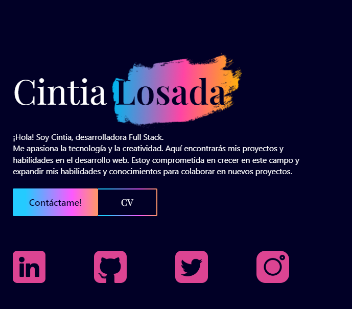

# 🌟 Mi Portafolio

¡Bienvenido a mi portafolio! Este proyecto muestra algunos de los trabajos y proyectos en los que he estado trabajando. 

## 🚀 Deploy
El proyecto se encuentra desplegado en <a href="https://cinlo-portfolio.netlify.app/" target="_blank">Netlify</a>.

## 🧰 Tecnologías Utilizadas

**React**: Para la creación de la interfaz de usuario y la lógica del lado del cliente.

**Tailwind CSS**: Framework de CSS para un diseño rápido y eficiente, además de responsivo y personalizable.

**Framer-Motion**: Libreria para animaciones y transiciones en React.

**Vite**: Herramienta de desarrollo para crear proyectos de React de manera rápida y eficiente.

## 📸 Página de Inicio

  

## 📞 Contacto

Si deseas ponerte en contacto conmigo, puedes hacerlo a través de:

- 📞 [LinkedIn](https://www.linkedin.com/in/cinlo-losada/)
- 📧 Enviarme un correo a cinlos3382@gmail.com

¡Gracias por visitar mi portafolio!